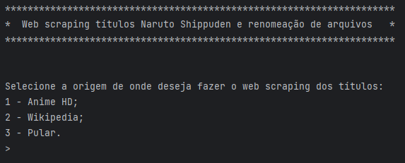
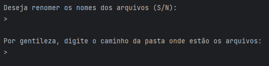
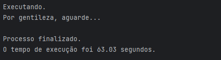
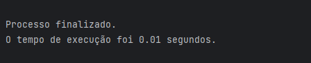
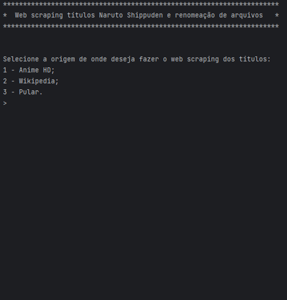
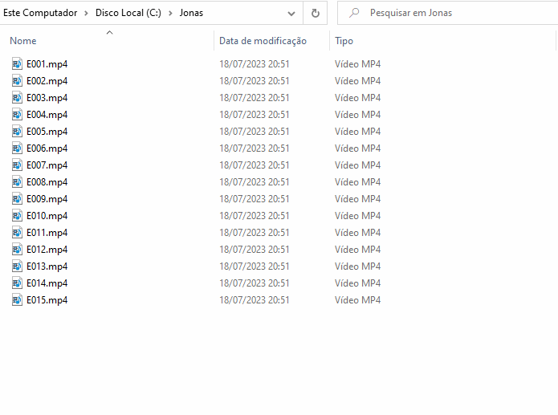

# Web scraping dos títulos dos capítulos do Naruto Shippuden e renomeação de arquivos MP4 com episódios

**SEJA BEM-VINDO A ESTE REPOSITÓRIO!!!**

-------------

**Instruções**

 - *Fork* este repositório;
 - Clone seu repositório *forked*;
 - Adicione seus scripts;
 - *Commit & Push*;
 - Crie um *pull request*;
 - Dê uma estrela para este repositório;
 - Aguarde que o seu *pull request* solicitado vire um *merge*;
 - Comemore, seu primeiro passo para o mundo de código aberto e continue contribuindo.

## Introdução

Projeto para realizar a raspagem em sites (Wikipedia e/ou Anime HD) dos títulos dos episódios de todas as 20 temporadas do Naruto Shippuden, suprimir caracteres inválidos, para nome de arquivos no Windows, e adicionar ao nome dos arquivos MP4 existentes.

Inicialmente a raspagem dos dados foram realizadas no site Wikipedia, porém eu notei que lá não havia informações dos episódios que eram semi fillers e/ou fillers. Por conta disso, acabei adicionando e deixando selecionável a raspagem em um segundo site, Anime HD, onde esse sim existe as informações se os episódios são semi fillers, fillers ou normais.

## Motivação

Tudo começou com a dificuldade de saber quais episódios eu já havia assistido e quais os próximos e não só isso. Os arquivos estava nomeados apenas com a inicial "E" e os três dígitos do número do episódio, sende de 001 até 500.

Como os nomes do episódios não continham o nome do episódio eu sempre precisa consultar na internet e saber do que se tratava a histório do episódio. Eu tinha a opção de toda vez consultar o nome do episódio na internet ou então facilitar a vida incluindo o nome do episódio diretamente no nome do arquivo MP4.

Se eu fizesse isso de forma manual seria muito trabalhoso. Eu deveria copiar um título por vez, pressionar a tecla "F2" sobre o arquivo MP4 correto, adiciona " - " (espaço, hífen, espaço) e depois colar o título do episódio que colei da internet. Fora isso, os títulos dos capitulos contém caracteres que não são aceitos no nome dos arquivos e eu teria que fazer uma sanitização manual no nome dos arquivos, lembrando que esse processo deveria ser repetido 500 vezes.

Por conta do citado acima, eu decidi automatizar todo esse processo fazendo a programação em Python (raspagem dos dados e renomeação dos arquivos MP4).

## Descrição do projeto

O projeto foi desenvolvido em Python 3.11 e dividido em 4 (quatro) arquivos (fix_file_names.py, from_anime_hd.py, from_wikipedia.py, main.py). A seguir vou explanar um pouco sobre o conteúdo de cada arquivo.

### Arquivo "main.py"

Esse é o arquivo principal do projeto. Ele faz a importação dos demais 3 (três) arquivos e faz a orquestração do funcionamento do projeto.

Foi criado um laço onde o usuário recebe informações no console. O programa aguarda a entrada de uma seleção disponibilizada para usuário, caso seja incorreta, apresenta novamente as informações para a seleção do usuário. Com a seleção correta do usuário, o programação direcionará o fluxo do programa para a lógica selecionada. As opções são:

1. Anime HD;
2. Wikipedia;
3. Pular.

Com a seleção de uma das 3 (três) opções pelo usuário, o programa executará a etapa correspondentes e ao final irá para a próxima etapa. A próxima etapa é questionar o usuário se ele deseja renomear os arquivos, ou ele pode informar que não caso só queira salvar o arquivo CSV com os 500 (quinhentos) títulos dos capítulos do Naruto Shippuden.

Caso o usuário selecione que deseja renomear os arquivos, ele deverá informar qual é o caminho onde se encontram os arquivos MP4 no próximo questionamento no console do programa. No caso do usuário entrar com opção inválida, o programa irá avisar e continuar aguardando uma opção válida.

Ao final da execução de todas etapas, será apresentada a mensagem "Obrigado e até logo" no console indicando que o programa chegou ao fim da execução.

### Arquivo "from_anime_hd.py"

Esse é o arquivo com o código responsável pela raspagem dos títulos dos capítulos no site Anime HD.

O arquivo utiliza as bibliotecas a seguir para realizar sua tarefa:

1. CSV;
2. Time;
3. Selenium.

Esse trecho do programa inicia capturando o horário atual para poder informar quanto tempo demorou a execução da raspagem das informações no site Anime HD. Depois ele acessa o site do Anime HD (sem abertura visível do browser) capturando os títulos, sanitizando o texto encontrado removendo os seguintes caracteres '\ / : * ? " < > |' e inserindo o resultado em uma lista. Ao final da coleta de todos os títulos dos capítulos, o programa grava a lista em arquivo no formato CSV (2 (duas) colunas, a primeira o número do capítulo e a segunda o título sanitizado).

Ao final desse processo acima, o programa informa no console que o processo de raspagem de dados foi finalizada informando o tempo gasto neste processo.

### Arquivo "from_wikipedia.py"

Esse é o arquivo com o código responsável pela raspagem dos títulos dos capítulos no site Wikipedia.

O arquivo utiliza as bibliotecas a seguir para realizar sua tarefa:

1. CSV;
2. Time;
3. Selenium.

Esse trecho do programa inicia capturando o horário atual para poder informar quanto tempo demorou a execução da raspagem das informações no site Wikipedia. Depois ele acessa o site do Wikipedia (sem abertura visível do browser) capturando os títulos, sanitizando o texto encontrado removendo os seguintes caracteres '\ / : * ? " < > |' e inserindo o resultado em uma lista. Ao final da coleta de todos os títulos dos capítulos, o programa grava a lista em arquivo no formato CSV (2 (duas) colunas, a primeira o número do capítulo e a segunda o título sanitizado).

Ao final desse processo acima, o programa informa no console que o processo de raspagem de dados foi finalizada informando o tempo gasto neste processo.

### Arquivo "fix_file_names.py"

Esse é o arquivo com o código responsável por verificar os arquivos MP4 disponíveis na pasta informada pelo usuário, abrir o arquivo CSV buscando o título do episódio corresponde ao arquivo MP4 detectado e renomeá-los.

O arquivo utiliza as bibliotecas a seguir para realizar sua tarefa:

1. OS;
2. Time.

Esse trecho do programa inicia capturando o horário atual para poder informar quanto tempo demorou a execução da renomeação dos arquivos MP4. Depois ele questiona o usuário qual o endereço da pasta que contém os arquivos MP4 que precisa alterar os nomes. Verifica se a pasta existe, se sim continua a lógica, caso o contrário informa ao usuário que a pasta é inexistente. No caso da pasta existir, ele faz a leitura do arquivo CSV contendo os títulos dos episódios, depois o programa pega o nome de cada arquivo na pasta e compara com o conteúdo do CSV, ao encontrar a resposta correspondente o programa renomeia um a um os arquivos MP4. Ao final desse processo, o programa informa que o processo de renomeação foi finalizado e qual foi o tempo que esse processo demorou.

### Bibliotecas e recursos utilizados

 - OS -> Biblioteca para funções do sistema operacional;
 - Time -> Para adição de tempo e registro do início, fim e duração do processo;
 - CSV -> Para leitura e escrita de arquivo CSV;
 - Selenium -> Para executar a raspagem das informações dos sites da internet.

### Funcionamento do programa no console

### Amostra do resultado da execução do programa

 ## Instalação e execução do projeto

 ...

 ## Licença

 MIT License
